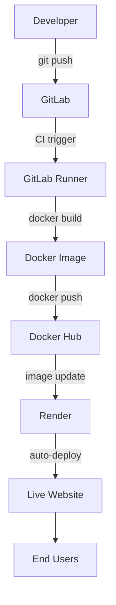
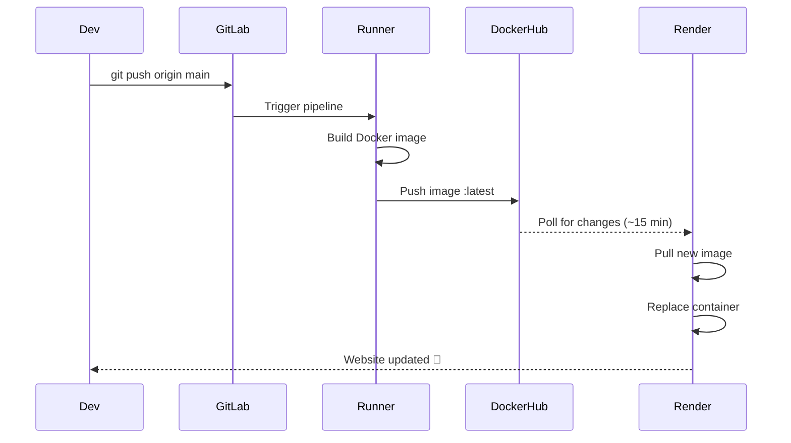

<!-- Header Banner (animated wave) -->
<p align="center">
  
</p>

<!-- Badges (shields.io) -->
<p align="center">
  <a href="https://pokeflip-pokedex.onrender.com/"></a>
  <a href="https://github.com/nadarmurugan/pokeflip-pokedex"></a>
  <a href="https://gitlab.com/murugannadar077/pokeflip"></a>
  
  
  
  
</p>

---

## 📌 Project Overview

**PokéFlip – Pokédex** is a lightweight, single‑page web application that displays Pokémon cards with detailed stats, types, weaknesses, and fun facts. While the frontend is intentionally simple, the true value of this project lies in the **production‑grade DevOps pipeline** built around it.

This project demonstrates a complete **end‑to‑end software delivery lifecycle**:

- **Version Control** – Git & GitLab for source management  
- **Containerization** – Docker for packaging the app and its environment  
- **Web Serving** – Nginx for high‑performance static content delivery  
- **CI/CD Automation** – GitLab CI that builds and pushes images on every commit  
- **Cloud Deployment** – Render for hosting the container with auto‑deploy  

> 🎯 **Goal:** To understand how modern applications move from development to production through automation, consistency, and infrastructure‑as‑code.

---

## 🧠 Why DevOps?

DevOps is more than a set of tools; it’s a **culture** that bridges development and operations. This project helped me internalize core DevOps principles:

| Principle | How It Was Applied |
|-----------|---------------------|
| **Automation** | GitLab CI triggers on every `git push`; no manual steps. |
| **Consistency** | Docker ensures the app runs identically on local machines, CI, and the cloud. |
| **Infrastructure as Code** | The `Dockerfile`, `nginx.conf`, and `.gitlab-ci.yml` define the entire environment declaratively. |
| **Immutable Infrastructure** | Each deployment replaces the old container – never modify a running system. |
| **Continuous Improvement** | Every error was documented and solved, leading to a more robust system. |

---

## 🛠️ Tech Stack & Architecture

<p align="center">
  
</p>

### System Architecture



**Component Responsibilities**

| Component       | Technology | Role |
|-----------------|------------|------|
| **Frontend**    | HTML, CSS, JS | Simple Pokémon card viewer |
| **Web Server**  | Nginx       | Serves static files with caching and compression |
| **Container**   | Docker      | Packages app + dependencies + Nginx configuration |
| **Version Control** | Git & GitLab | Source code hosting and pipeline management |
| **CI/CD**       | GitLab CI   | Builds and pushes the Docker image automatically |
| **Registry**    | Docker Hub  | Stores the final image (tagged `:latest`) |
| **Cloud Host**  | Render      | Runs the container, provides HTTPS, auto‑redeploys on image changes |

---

## ⚙️ CI/CD Pipeline – How It Works



**Key Points**
- **No manual intervention** – the pipeline runs automatically.
- **Same image everywhere** – the Docker image built in CI is exactly the one deployed.
- **Immutable deployment** – each release creates a new container; rollback is just pulling an older image.

---

## 🔍 Deep Dive: Tools & Concepts

<details>
<summary><b>🐙 Git & Version Control</b> (click to expand)</summary>

**Why it matters**  
Git tracks every change, enables collaboration, and provides a safety net. In DevOps, it’s the foundation of all automation – CI/CD pipelines start with a commit.

**What I practiced**
- Branching (`git branch`, `git checkout -b`)
- Rebasing vs merging (`git pull --rebase`)
- Resolving conflicts
- Writing meaningful commit messages

**Key insight**  
A clean Git history is not just for aesthetics – it makes debugging and rollbacks significantly easier.
</details>

<details>
<summary><b>🐳 Docker & Containerization</b></summary>

**Why it matters**  
Docker eliminates the classic “works on my machine” problem. It packages an application with all its dependencies into a lightweight, portable container.

**What I practiced**
- Writing a multi‑stage `Dockerfile` (using `nginx:alpine` for minimal size)
- Building, tagging, and pushing images
- Port mapping (`-p 8080:80`) to expose services
- Inspecting containers with `docker exec` and `docker logs`

**Key insight**  
A small base image (Alpine) reduces attack surface and speeds up deployments.
</details>

<details>
<summary><b>🌐 Nginx Web Server</b></summary>

**Why it matters**  
Nginx is a high‑performance, production‑grade web server used by companies like Netflix. It handles static files efficiently and can act as a reverse proxy, load balancer, and cache.

**What I practiced**
- Writing a custom `nginx.conf` to serve static files
- Enabling caching for static assets (`expires 30d`)
- Setting up `try_files` for clean URLs

**Key insight**  
Proper caching reduces server load and dramatically improves user experience.
</details>

<details>
<summary><b>🔄 GitLab CI/CD</b></summary>

**Why it matters**  
CI/CD automates the build, test, and deploy process, reducing human error and speeding up delivery.

**What I practiced**
- Defining pipeline stages in `.gitlab-ci.yml`
- Using **Docker‑in‑Docker** (`docker:dind`) to build images inside the pipeline
- Injecting secrets (Docker Hub credentials) as CI variables

**Key insight**  
A well‑written pipeline can be the single source of truth for how the application is built and deployed.
</details>

<details>
<summary><b>☁️ Cloud Deployment on Render</b></summary>

**Why it matters**  
Modern applications are deployed to the cloud. Render provides a free tier that supports Docker, automatic HTTPS, and auto‑deploy from a registry.

**What I practiced**
- Creating a web service from an existing Docker image
- Configuring auto‑deploy (polls Docker Hub every 15–20 minutes)
- Dealing with free‑tier limitations (cold starts, 512 MB RAM)

**Key insight**  
Understanding deployment platforms – even their free tier quirks – is essential for production readiness.
</details>

---

## 🐞 Issues Faced & How I Solved Them

Real‑world problems taught me more than the smooth parts. Here are some notable challenges and their solutions:

| Issue | Root Cause | Resolution |
|-------|------------|------------|
| **Git push rejected** | Remote had a README, local and remote histories diverged. | Used `git pull --rebase` to merge cleanly. |
| **YAML indentation error** | Wrong spaces in `.gitlab-ci.yml`. | Validated with online YAML linter; fixed spacing. |
| **Render not auto‑deploying** | Render polls Docker Hub every 15–20 minutes, not instantly. | Waited; later used manual deploy for immediate updates. |
| **Branch name confusion** (`master` vs `main`) | Local default branch was `master`, remote expected `main`. | Renamed local branch and configured Git default. |
| **Nginx 403 Forbidden** | File permissions – files owned by root, Nginx runs as `nginx` user. | Added `RUN chown -R nginx:nginx /usr/share/nginx/html` in Dockerfile. |

---

## 🧪 My Debugging Methodology

When something breaks, I follow a systematic approach:

1. **Observe** – What is happening vs. what should happen?  
2. **Isolate** – Can I reproduce it? What changed recently?  
3. **Research** – Check official docs, search error messages, ask community.  
4. **Experiment** – Test one fix at a time, document results.  
5. **Learn & Document** – Write down the root cause and solution for future reference.

**Tools I used**
- `git log`, `git status` for version control issues
- `docker logs`, `docker exec` for container troubleshooting
- Render’s built‑in logs
- Online YAML validators
- [explainshell.com](https://explainshell.com) for Linux commands
- Stack Overflow for community wisdom

---

## 📚 Learning Outcomes & Skills Acquired

| Skill Area | What I Learned |
|------------|----------------|
| **Git & Version Control** | Branching, rebasing, resolving conflicts, commit hygiene |
| **Docker** | Writing Dockerfiles, building and pushing images, container management |
| **Nginx** | Configuring server blocks, caching, serving static files |
| **CI/CD** | Pipeline design, Docker‑in‑Docker, secret management |
| **Cloud Deployment** | Using Render, handling free‑tier limitations, auto‑deploy strategies |
| **Troubleshooting** | Systematic debugging, reading logs, using community resources |

---

## 🔮 Future Improvements

Even though the project is complete, there’s always room to grow. Here’s what I’d add next:

- **Commit‑based image tags** – Use `:git-commit-sha` alongside `:latest` for traceability.
- **Staging branch** – Separate `develop` branch for testing before production.
- **Health checks** – Add `/health` endpoint and configure Render to monitor it.
- **Rollback strategy** – Ability to revert to a previous image if something fails.
- **Docker Compose** – For local multi‑container setup (e.g., adding a database).
- **Modern frontend** – Convert to React or Vue for a richer UI.
- **Kubernetes** – Deploy to a managed Kubernetes service for orchestration experience.

---

## 📖 References & Resources

I relied heavily on documentation and community resources. Here are the most valuable ones:

| Category | Resource |
|----------|----------|
| **Docker** | [Docker Official Docs](https://docs.docker.com) |
| **GitLab CI** | [GitLab CI/CD Docs](https://docs.gitlab.com/ee/ci) |
| **Nginx** | [Nginx Documentation](https://nginx.org/en/docs) |
| **Render** | [Render Deployment Guide](https://render.com/docs) |
| **DevOps Roadmap** | [roadmap.sh/devops](https://roadmap.sh/devops) |
| **Linux Commands** | [explainshell.com](https://explainshell.com) |

---

## 📞 Connect & Collaborate

**Jeyamurugan Nadar**  
*Aspiring Cloud & DevOps Engineer*  
*Transitioning from Web Development to Cloud Infrastructure*

<p align="left">
  <a href="https://github.com/nadarmurugan" target="_blank">
    
  </a>
  <a href="https://linkedin.com/in/murugannadar/" target="_blank">
    
  </a>
  <a href="mailto:murugannadar077@gmail.com">
    
  </a>
</p>

---

<p align="center">
  <i>“Automate everything, document everything, and never stop learning.”</i>
</p>

<p align="center">
  
</p>
```
